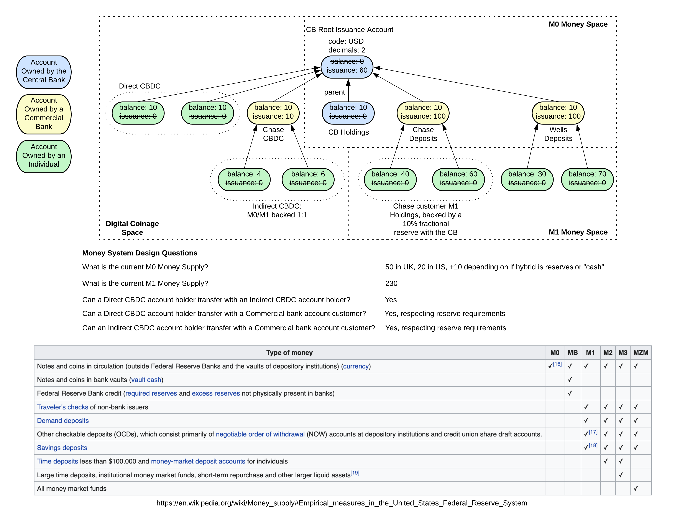

# Sample CBDC Recipe

This section is intended to inform the user 

## Terminology

The following is a list of actors with the roles they would play in this system. 

| Term      | Description |
| ----------- | ----------- |
| CBDC Admin  | The central banks operator that is responsible for issuing and destroying m0 currency. Responsibilities include creating accounts for M1 banks and transferrence as well.        |
| Commercial Bank  |   A bank created by the CBDC admin. Typically has holdings at the CBDC account (m0) and has issued client accounts (m1)   |
| Operator  |  The account used by the m0 currency issuer for CBDC operations. This has more elevated access than the CBDC key.       |
| Instrument | An m0 currency issued by the CBDC. The instrument in this example is 'XYZ'  |

# Initial considerations

The following steps are an in-order example of setting up an hybrid CBDC model. Here's a diagram with some questions to ask before setting up your banking ledger.

# Recipe location

The integration test area can be [found here](./hybrid.test.ts)

## Creating m0 currency

* Prerequisites - Root account instantiation.

The test header is `Create m0 currency`.

## Destroy m0 currency

<TBD>

## Creating commercial bank accounts

* Prerequisites - Creating bank accounts requires creating an appropriate m0 currency first. 

It's important to realize that a commercial bank account is bound to the currency, and if you wish to use it for another currency, you must create a separate account with the same public key.

The test header is `Creating m1 bank accounts for XYZ currency`.

## Issuance of m0 currency to commercial bank

* Prerequisites - Created an appropriate m0 currency first. Created a holding account in a commercial bank.

Currency comes out of the m0 currency above and is just a transfer in our system.

The test header is `Creating m1 bank accounts for XYZ currency`.

## Redemption of m1 currency to CBDC

